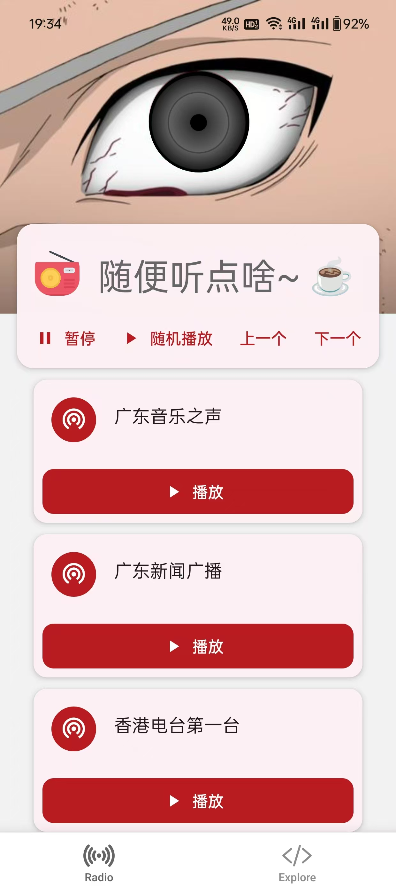
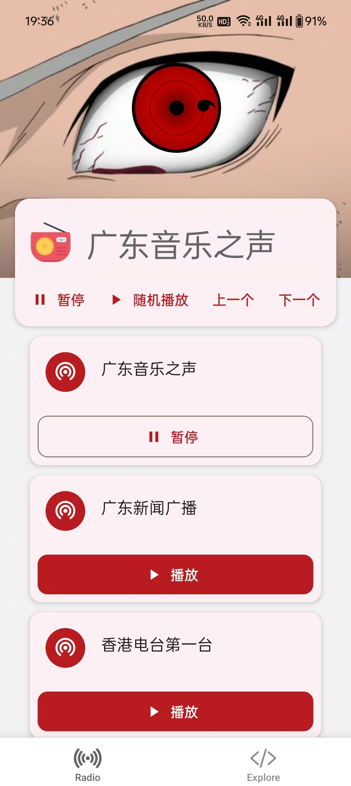
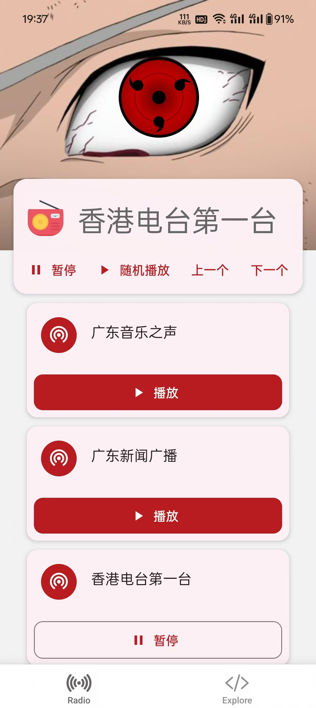

  elfie-radio - 用于 Android 的网络收音机 APP

## 简介
&emsp;&emsp;elfie 是一个网络收音机APP，其实现了写轮眼播放效果

1. 源码仓库：[Github](https://github.com/maoguy/elfie-radio)
2. 下载地址：[Github Releases](https://github.com/maoguy/elfie-radio/releases)

## 截图

## 录屏
[video:切换电台](./docs/vids/radio-toggle.mp4)

## 用法
下载 APK 直接安装
